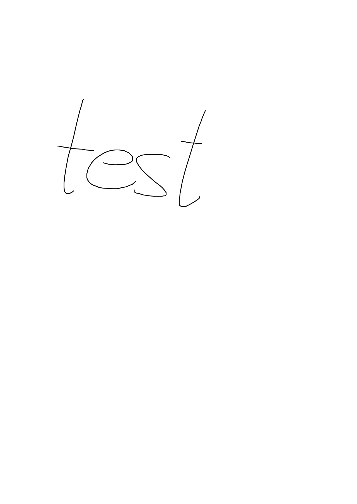
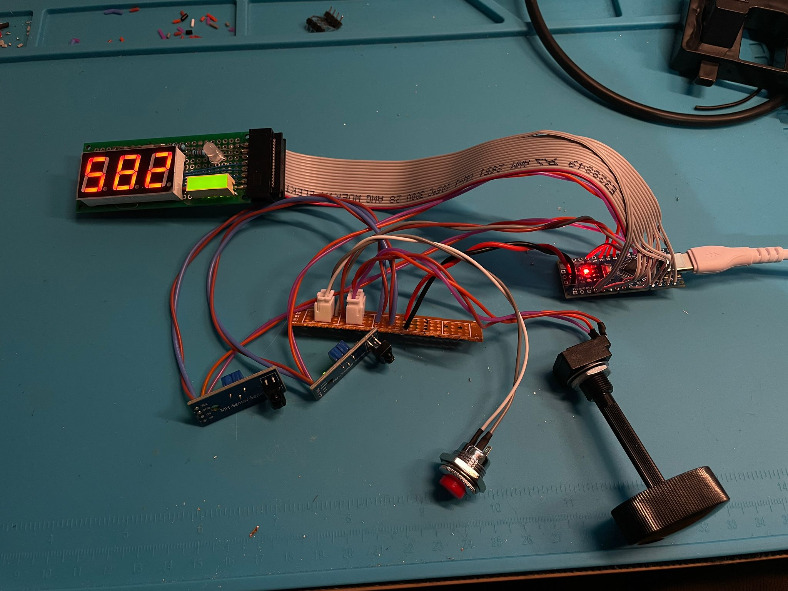
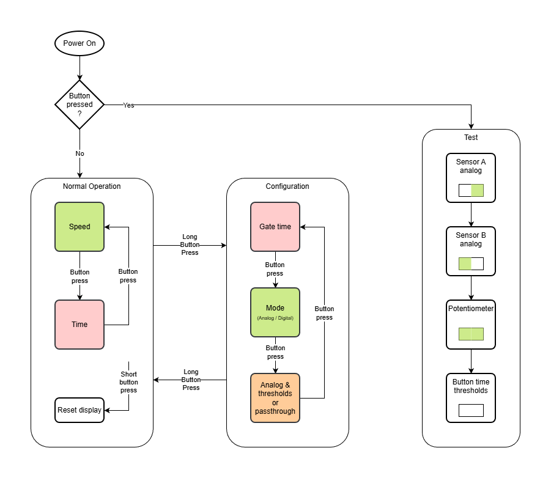

# Summary

* This is the first list item.
* Here's the second list item.

    > A blockquote would look great below the second list item.

* And here's the third list item.

# Components

<html>
   <head>
     <title>Test</title>
   </head>

# Usage

image test

 Arduino Nano")

UNITS! mm/s

